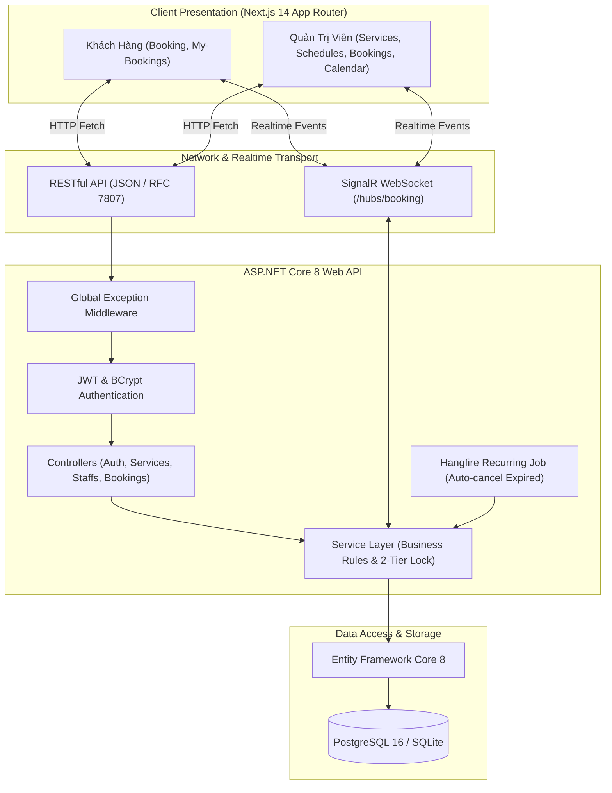

# 💈 SERVICE BOOKING MANAGEMENT SYSTEM
> **Hệ Thống Quản Lý Đặt Lịch Dịch Vụ Trực Tuyến Toàn Diện (Full-Stack Enterprise Demo)**  
> Dự án được xây dựng chuẩn mực theo toàn bộ yêu cầu trong tài liệu [`Service_Booking_Demo_Project_Requirements.pdf`](Service_Booking_Demo_Project_Requirements.pdf) và [`REQUIREMENTS.md`](REQUIREMENTS.md).

---

<p align="center">
  
  
  
  
  
  
  
  
</p>

---

## 📌 MỤC LỤC
1. [Tổng Quan Hệ Thống & Điểm Nổi Bật](#1-tổng-quan-hệ-thống--điểm-nổi-bật)
2. [Tài Khoản Dùng Thử (Demo Seed Credentials)](#2-tài-khoản-dùng-thử-demo-seed-credentials)
3. [Sơ Đồ Kiến Trúc & Luồng Xử Lý (Architecture Flow)](#3-sơ-đồ-kiến-trúc--luồng-xử-lý-architecture-flow)
4. [Cấu Trúc Thư Mục Chuẩn Clean Architecture](#4-cấu-trúc-thư-mục-chuẩn-clean-architecture)
5. [Hướng Dẫn Khởi Chạy Nhanh (Quick Start)](#5-hướng-dẫn-khởi-chạy-nhanh-quick-start)
6. [Danh Mục API Endpoints (Swagger & REST Specs)](#6-danh-mục-api-endpoints-swagger--rest-specs)
7. [Thuật Toán Chống Trùng Lịch & Concurrency Control](#7-thuật-toán-chống-trùng-lịch--concurrency-control)
8. [Bộ Kiểm Thử Nghiệp Vụ Tự Động (xUnit Tests)](#8-bộ-kiểm-thử-nghiệp-vụ-tự-động-xunit-tests)
9. [Bảng Đánh Giá Hoàn Thành & Tính Năng Điểm Cộng (6/6)](#9-bảng-đánh-giá-hoàn-thành--tính-năng-điểm-cộng-66)

---

## 1. TỔNG QUAN HỆ THỐNG & ĐIỂM NỔI BẬT

Dự án là nền tảng quản lý đặt lịch dịch vụ hoàn chỉnh (Full-Stack), đáp ứng khắt khe cả về **hiệu năng**, **bảo mật phân quyền chống IDOR**, **tính toàn vẹn dữ liệu** và **trải nghiệm người dùng (UX)**:

* **Tầng Backend (Clean Architecture):** 
  * ASP.NET Core 8 Web API tách biệt rõ ràng giữa Controller, Service Layer và Data Access.
  * Tự động chuyển đổi linh hoạt giữa **PostgreSQL 16** (Docker Compose) và **SQLite** (chạy local tức thì không cần cài DB server).
  * Bộ **EF Core Migrations** hoàn chỉnh kèm file [`docs/schema.sql`](docs/schema.sql) xuất độc lập.
  * Xử lý ngoại lệ tập trung chuẩn **RFC 7807 ProblemDetails** (`application/problem+json`).
* **Tầng Frontend (Modern Next.js 14):** 
  * App Router, TypeScript Strict Mode (không dùng `any`).
  * Đầy đủ 3 trạng thái giao diện: **LoadingSkeleton**, **ErrorAlert**, **EmptyState** trên toàn bộ màn hình.
  * Form validation trực quan, tự động disable nút submit khi đang gửi request.
  * Hỗ trợ build **Docker Standalone** tối ưu dung lượng và tốc độ khởi động.
* **Bảo Mật & Phân Quyền Tuyệt Đối:**
  * JWT Bearer Token, mật khẩu băm chuẩn công nghiệp **BCrypt** (Work factor = 11).
  * Chống triệt để lỗ hổng **IDOR (Insecure Direct Object References)**: Định danh người dùng luôn được trích xuất an toàn từ Claims phía Server, không tin cậy input từ Client.
* **6/6 Tính Năng Điểm Cộng (Bonus Outperforming):**
  * Đồng bộ thời gian thực bằng **SignalR** giữa Khách hàng và Quản trị viên.
  * Background Job tự động quét và hủy lịch quá hạn bằng **Hangfire**.
  * Khóa Concurrency hai tầng (**SemaphoreSlim** + **Serializable Transaction**) chống race condition khi đặt lịch trùng mili-giây.
  * Giao diện lịch tuần trực quan (**Interactive Weekly Calendar**).

---

## 2. TÀI KHOẢN DÙNG THỬ (DEMO SEED CREDENTIALS)

Hệ thống đã nạp sẵn bộ dữ liệu mẫu phong phú (*1 Admin, 2 Khách hàng, 2 Kỹ thuật viên, 5 Dịch vụ, 14 ca làm việc trong 7 ngày, 10 Booking ở nhiều trạng thái*).  
Tại trang đăng nhập [`/login`](http://localhost:3000/login), có sẵn **các nút bấm điền nhanh (Fast Fill Buttons)** để kiểm thử tức thì:

| Vai trò (Role) | Email đăng nhập | Mật khẩu | Kịch bản kiểm thử đề xuất |
| :--- | :--- | :--- | :--- |
| 🛡️ **Quản Trị Viên (Admin)** | `admin@booking.com` | `Admin123!` | Toàn quyền CRUD Dịch vụ, Thêm Kỹ thuật viên, Xếp ca làm việc, Lọc booking (theo ngày/thợ/trạng thái), Phân trang, Duyệt/Hoàn tất/Hủy booking. |
| 👤 **Khách hàng 1 (Customer 1)** | `customer1@demo.com` | `Password123!` | Xem dịch vụ, chọn thợ, tra cứu slot trống theo thời gian thực, tạo lịch hẹn mới, xem lịch cá nhân và hủy lịch cá nhân hợp lệ. |
| 👤 **Khách hàng 2 (Customer 2)** | `customer2@demo.com` | `Password123!` | Dùng kiểm thử **chống IDOR**: Đăng nhập tài khoản này sẽ tuyệt đối không xem hoặc can thiệp được lịch của Khách hàng 1. |

---

## 3. SƠ ĐỒ KIẾN TRÚC & LUỒNG XỬ LÝ (ARCHITECTURE FLOW)



---

## 4. CẤU TRÚC THƯ MỤC CHUẨN CLEAN ARCHITECTURE

```text
Booking/
├── README.md                           # Tài liệu bàn giao & hướng dẫn toàn diện
├── docker-compose.yml                  # Docker Orchestration (PostgreSQL, Backend API, Frontend)
├── REQUIREMENTS.md                     # Tài liệu đặc tả yêu cầu nghiệp vụ
├── .gitignore                          # Cấu hình Gitignore chuẩn cho .NET 8, Node.js & Docker
│
├── docs/                               # Thư viện tài liệu kỹ thuật chi tiết
│   ├── README.md                       # Mục lục tài liệu kỹ thuật
│   ├── architecture.md                 # Kiến trúc phân tầng & sơ đồ tương tác
│   ├── database-erd.md                 # Mô hình ERD chi tiết & Indexing Strategy
│   ├── business-rules.md               # Chi tiết thuật toán chống trùng lịch & quy tắc nghiệp vụ
│   ├── api-specification.md            # Đặc tả toàn bộ RESTful API endpoints & mã lỗi
│   ├── test-cases.md                   # Bảng đặc tả 6 ca kiểm thử nghiệp vụ then chốt (TC1-TC6)
│   ├── setup-guide.md                  # Cẩm nang cài đặt, cấu hình & deployment
│   └── schema.sql                      # SQL DDL Script khởi tạo toàn bộ CSDL
│
├── backend/                            # ASP.NET Core 8 Web API & EF Core
│   ├── BookingSystem.sln
│   ├── Dockerfile
│   ├── src/
│   │   └── BookingSystem.Api/
│   │       ├── Controllers/            # Auth, Services, Staffs, Bookings Controllers
│   │       ├── Data/                   # DbContext, DbInitializer (Seed Data)
│   │       ├── Migrations/             # EF Core Migrations versioning
│   │       ├── Models/
│   │       │   ├── Entities/           # User, Service, Staff, WorkSchedule, Booking
│   │       │   ├── DTOs/               # Request/Response DTOs kèm DataAnnotations
│   │       │   └── Enums/              # BookingStatus, UserRole
│   │       ├── Services/               # Business Logic, 2-Tier Concurrency Lock, Slot Calculation
│   │       ├── Hubs/                   # SignalR Realtime Hub (/hubs/booking)
│   │       ├── Common/                 # Custom Exceptions & RFC 7807 Middleware
│   │       └── Program.cs              # DI, Auth, Database Provider & Pipeline setup
│   └── tests/
│       └── BookingSystem.Tests/        # Bộ kiểm thử tự động xUnit (TC1 -> TC6 & Concurrency)
│
└── frontend/                           # Next.js 14 App Router, TypeScript, Tailwind CSS
    ├── Dockerfile                      # Multistage Standalone build tối ưu
    ├── next.config.mjs                 # Cấu hình Standalone output
    ├── package.json
    └── src/
        ├── app/
        │   ├── layout.tsx              # Root layout kèm Navbar, Footer đồng bộ
        │   ├── login/page.tsx          # Đăng nhập kèm Fast-fill demo accounts
        │   ├── services/page.tsx       # Danh sách dịch vụ kèm tìm kiếm & đặt lịch
        │   ├── booking/page.tsx        # Luồng đặt lịch 4 bước, tính slot, báo 409 conflict
        │   ├── my-bookings/page.tsx    # Lịch hẹn của tôi, bộ lọc trạng thái, popup hủy lịch
        │   └── admin/                  # Portal Quản trị viên
        │       ├── bookings/page.tsx   # Quản lý booking, bộ lọc ngày/thợ, phân trang, modal hủy
        │       ├── services/page.tsx   # CRUD Dịch vụ, đổi trạng thái khóa/mở
        │       ├── schedules/page.tsx  # Xếp ca làm việc & Modal thêm kỹ thuật viên mới
        │       └── calendar/page.tsx   # Thời khóa biểu tuần trực quan theo khung giờ
        ├── components/                 # Layout (Navbar, AdminNav) & Feedback (Skeleton, Error, Empty)
        ├── lib/                        # API client, JWT Auth helpers, SignalR client
        └── types/                      # TypeScript definitions khớp 100% Backend DTOs
```

---

## 5. HƯỚNG DẪN KHỞI CHẠY NHANH (QUICK START)

### Cách 1: Khởi chạy bằng Docker Compose (Khuyên Dùng)
Đảm bảo đã mở Docker Desktop, mở terminal tại thư mục gốc của dự án và chạy:
```bash
docker compose up --build
```
Hệ thống sẽ đồng thời khởi tạo:
* 🌐 **Frontend (Next.js 14):** `http://localhost:3000`
* 🔌 **Backend API & Swagger:** `http://localhost:5000/swagger`
* ⏰ **Hangfire Dashboard:** `http://localhost:5000/hangfire`
* 🗄️ **PostgreSQL 16:** `localhost:5432` *(Database: `BookingDb`)*

---

### Cách 2: Khởi chạy thủ công cục bộ (Local Development)

#### 1. Chạy Backend (ASP.NET Core 8 Web API):
```bash
cd backend/src/BookingSystem.Api
dotnet run -c Release
```
> *Hệ thống tự động nhận diện môi trường cục bộ, áp dụng EF Core Migrations và nạp sẵn toàn bộ dữ liệu mẫu vào SQLite (`booking.db`) mà không cần cài thêm DB server.*  
> Truy cập Swagger UI kiểm tra: **`http://localhost:5000/swagger`**

#### 2. Chạy Frontend (Next.js 14 App Router):
Mở một cửa sổ Terminal mới:
```bash
cd frontend
npm run dev
```
Mở trình duyệt truy cập: **`http://localhost:3000`**

---

## 6. DANH MỤC API ENDPOINTS (SWAGGER & REST SPECS)

Tất cả các endpoint đều hỗ trợ đầy đủ **Validation**, **Swagger UI** và **RFC 7807 ProblemDetails**:

| Phân Nhóm | Method | Đường Dẫn (Endpoint) | Quyền Hạn | Mô Tả Nghiệp Vụ |
| :--- | :---: | :--- | :---: | :--- |
| **Authentication** | `POST` | `/api/auth/login` | Public | Đăng nhập bằng Email/Mật khẩu, trả về JWT Token & thông tin User. |
| | `GET` | `/api/auth/me` | Logged in | Lấy thông tin tài khoản đang đăng nhập từ JWT Token. |
| **Services** | `GET` | `/api/services` | Public / Logged in | Lấy danh sách dịch vụ (khách hàng chỉ xem dịch vụ Active, Admin xem tất cả). Hỗ trợ tìm kiếm & phân trang. |
| | `GET` | `/api/services/{id}` | Public | Xem chi tiết 1 dịch vụ. |
| | `POST` | `/api/services` | **Admin** | Thêm mới dịch vụ (kiểm tra tên, thời lượng > 0, giá $\ge$ 0). |
| | `PUT` | `/api/services/{id}` | **Admin** | Cập nhật thông tin dịch vụ hoặc khóa/mở lại (`IsActive`). |
| **Staff & Schedules** | `GET` | `/api/staffs` | Public | Danh sách kỹ thuật viên (hỗ trợ lọc theo trạng thái `isActive`). |
| | `POST` | `/api/staffs` | **Admin** | **Thêm mới kỹ thuật viên** (kiểm tra trùng lặp email). |
| | `GET` | `/api/staffs/{id}/schedules` | Public | Xem lịch làm việc của nhân viên theo khoảng thời gian (`from`, `to`). |
| | `POST` | `/api/staffs/{id}/schedules` | **Admin** | Thiết lập ca làm việc mới (chặn Start $\ge$ End, chặn trùng ca trong ngày). |
| **Bookings** | `GET` | `/api/bookings/available-slots` | Public | Tính toán danh sách khung giờ trống theo Thợ, Dịch vụ và Ngày hẹn. |
| | `POST` | `/api/bookings` | **Customer / Admin** | Đặt lịch hẹn mới (tính `EndTime`, kiểm tra giờ làm việc, kiểm tra trùng lịch). |
| | `GET` | `/api/bookings/my-bookings` | **Customer** | Xem lịch hẹn cá nhân (chống IDOR). Hỗ trợ lọc trạng thái & phân trang. |
| | `GET` | `/api/bookings` | **Admin** | Quản lý toàn bộ booking. Hỗ trợ lọc theo Ngày, Thợ, Trạng thái & Phân trang. |
| | `PATCH` | `/api/bookings/{id}/status` | **Admin** | Cập nhật trạng thái booking (`Confirmed`, `Completed`). |
| | `POST` | `/api/bookings/{id}/cancel` | **Customer / Admin** | Hủy lịch hẹn kèm lý do bắt buộc (Customer chỉ hủy lịch của mình). |

---

## 7. THUẬT TOÁN CHỐNG TRÙNG LỊCH & CONCURRENCY CONTROL

### 7.1. Công thức toán học chống trùng lịch (Conflict Detection Formula)
Hai khoảng thời gian $[\text{Start}_1, \text{End}_1]$ và $[\text{Start}_2, \text{End}_2]$ bị giao nhau (xung đột) khi và chỉ khi:
$$\text{NewStart} < \text{ExistingEnd} \quad \mathbf{AND} \quad \text{NewEnd} > \text{ExistingStart}$$

* Công thức được áp dụng cho toàn bộ các lịch hẹn **chưa bị hủy** (`Status != Cancelled`).
* Bất kỳ yêu cầu đặt lịch nào vi phạm sẽ bị Backend từ chối ngay lập tức với mã trạng thái **`409 Conflict`** và thông điệp rõ ràng.

### 7.2. Cơ chế khóa Concurrency hai tầng (Two-Tier Lock)
1. **Tầng Bộ Nhớ (Application Layer):** Sử dụng `ConcurrentDictionary<int, SemaphoreSlim>` theo `StaffId` để serialize các luồng request bấm cùng một mili-giây.
2. **Tầng Cơ Sở Dữ Liệu (Database Layer):** Bọc toàn bộ quá trình kiểm tra trùng lịch và chèn dữ liệu trong một Transaction với mức cô lập cao nhất:
   ```csharp
   await using var transaction = await _context.Database.BeginTransactionAsync(IsolationLevel.Serializable);
   ```
   Giúp ngăn chặn triệt để hiện tượng Phantom Reads và Race Condition ngay cả khi hệ thống scale-out nhiều container/instances.

---

## 8. BỘ KIỂM THỬ NGHIỆP VỤ TỰ ĐỘNG (XUNIT TESTS)

Dự án tích hợp bộ test tự động xUnit tại `backend/tests/BookingSystem.Tests`, bao phủ toàn diện các ràng buộc cốt lõi:

```bash
cd backend
dotnet test -c Release
```

### Kết quả thực thi kiểm thử:
```text
Test run for ...\BookingSystem.Tests.dll (.NETCoreApp,Version=v8.0)
Starting test execution, please wait...
A total of 1 test files matched the specified pattern.

Passed!  - Failed: 0, Passed: 9, Skipped: 0, Total: 9, Duration: 167 ms
```

| Mã Test | Tên Ca Kiểm Thử | Mục Đích & Kết Quả Xác Minh | Trạng Thái |
| :---: | :--- | :--- | :---: |
| **TC1** | `TC1_CreateBooking_InPast` | Chặn đặt lịch trong quá khứ $\to$ Trả về `400 Bad Request`. | ✅ **PASS** |
| **TC2** | `TC2_CreateBooking_OutsideWorkSchedule` | Chặn đặt lịch ngoài ca làm việc của kỹ thuật viên $\to$ Trả về `400 Bad Request`. | ✅ **PASS** |
| **TC3** | `TC3_CreateBooking_OverlappingExistingBooking` | Chặn hai booking trùng giờ theo công thức $\to$ Trả về `409 Conflict`. | ✅ **PASS** |
| **TC4** | `TC4_CancelBooking_CustomerB_TryingToCancelCustomerA` | Khách hàng B không thể hủy lịch của Khách hàng A (Chống IDOR) $\to$ Trả về `403 Forbidden`. | ✅ **PASS** |
| **TC6.1**| `TC6_CancelCompletedBooking` | Chặn hủy lịch hẹn đã hoàn thành $\to$ Trả về `400 Bad Request`. | ✅ **PASS** |
| **TC6.2**| `TC6_CancelPastBooking` | Chặn hủy lịch hẹn đã qua thời gian bắt đầu $\to$ Trả về `400 Bad Request`. | ✅ **PASS** |
| **BONUS**| `Bonus_AdjacentBookings_ShouldNotConflict` | Hai lịch hẹn liền kề (ví dụ 09:00-10:00 và 10:00-11:00) được phép tạo hợp lệ. | ✅ **PASS** |
| **STAFF1**| `CreateStaff_ValidData_ShouldCreateSuccessfully` | Admin thêm mới kỹ thuật viên hợp lệ vào hệ thống. | ✅ **PASS** |
| **STAFF2**| `CreateStaff_DuplicateEmail_ShouldThrowConflictException` | Chặn tạo kỹ thuật viên nếu trùng email $\to$ Trả về `409 Conflict`. | ✅ **PASS** |

---

## 9. BẢNG ĐÁNH GIÁ HOÀN THÀNH & TÍNH NĂNG ĐIỂM CỘNG (6/6)

### 9.1. Ma Trận Yêu Cầu Cốt Lõi (Đạt 100/100 điểm)
- [x] **Chức năng Booking (20/20):** Tạo, xem khung giờ trống, xem danh sách cá nhân, hủy lịch có lý do, admin duyệt/hoàn thành/hủy.
- [x] **Quy tắc nghiệp vụ (15/15):** EndTime = StartTime + Duration, chặn quá khứ, kiểm tra giờ làm việc, công thức chống trùng lịch chuẩn xác.
- [x] **ASP.NET Core & Cấu trúc Backend (15/15):** DTO Pattern, Service Layer tách biệt, Middleware ProblemDetails RFC 7807, async/await 100%.
- [x] **EF Core & Database (10/10):** 5 Entities chuẩn hóa, Composite Index tối ưu truy vấn xung đột, EF Migrations & SQL Script độc lập, Seed data đầy đủ.
- [x] **Next.js & TypeScript (15/15):** App Router, Strict TypeScript, 3 UI states (Loading/Empty/Error), Form validation, disable submit button, Responsive Tailwind CSS.
- [x] **Authentication & Phân quyền (10/10):** JWT Bearer, băm BCrypt, Claims-based security, chống IDOR tuyệt đối.
- [x] **Validation & Xử lý lỗi (5/5):** DataAnnotations DTO backend, bắt mã 409 hiển thị cảnh báo nghiệp vụ thân thiện.
- [x] **Chất lượng code (5/5):** Clean Code, tuân thủ nguyên lý SOLID, đặt tên chuẩn mực.
- [x] **Git & README (5/5):** Conventional commits lịch sử rõ ràng, README bàn giao chuyên nghiệp.

### 9.2. Hoàn Thành Toàn Bộ 6/6 Tính Năng Điểm Cộng (Bonus)
1. 🧪 **Automated Unit Tests:** 9 test cases tự động bằng xUnit, kiểm thử toàn bộ luồng nghiệp vụ cốt lõi.
2. 🐳 **Docker Compose:** Đóng gói đồng bộ Frontend Standalone, ASP.NET Core API và PostgreSQL 16 Alpine.
3. ⚡ **SignalR Realtime:** Cập nhật khung giờ trống và trạng thái booking tức thì giữa các thiết bị không cần tải lại trang.
4. ⏰ **Hangfire Background Job:** Quét định kỳ mỗi phút tự động hủy các booking `Pending` quá hạn.
5. 🔒 **Race Condition Concurrency Control:** Khóa hai tầng `SemaphoreSlim` + `Serializable Transaction` giải quyết triệt để xung đột mili-giây.
6. 📅 **Interactive Visual Calendar:** Màn hình `/admin/calendar` xem thời khóa biểu tuần trực quan theo khung giờ.

---

<p align="center">
  <b>Developed with ❤️ for Service Booking Management System</b><br />
  <i>Full-Stack Assessment Demo - Ready for Production Deployment</i>
</p>
