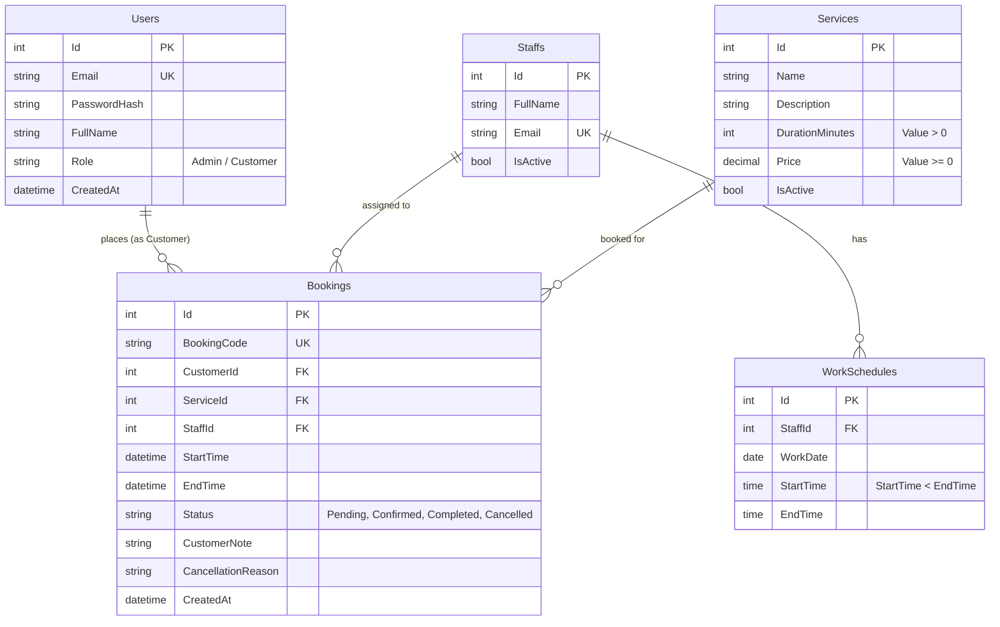

# TÀI LIỆU YÊU CẦU DỰ ÁN: SERVICE BOOKING MANAGEMENT SYSTEM
> **Hệ thống Quản lý Đặt lịch Dịch vụ (Full-Stack Demo)**  
> *Được trích xuất và tổng hợp chi tiết từ tài liệu `Service_Booking_Demo_Project_Requirements.pdf` dành cho AI Agent và Developer tham chiếu thực hiện.*

---

## 1. TỔNG QUAN DỰ ÁN (PROJECT OVERVIEW)

- **Vị trí tuyển dụng / Đánh giá**: Full-stack Intern.
- **Mục tiêu**: Đánh giá năng lực xây dựng một luồng nghiệp vụ hoàn chỉnh end-to-end từ Database, API Backend đến Giao diện Frontend.
- **Tiêu chuẩn giao diện**: Không cần quá cầu kỳ nhưng phải rõ ràng, chỉn chu, có tính khả dụng cao và sử dụng được thực tế.
- **Phạm vi cốt lõi**:
  1. Đăng nhập & phân quyền.
  2. Quản lý dịch vụ.
  3. Thiết lập lịch làm việc cho nhân viên.
  4. Đặt lịch dịch vụ & tính toán khung giờ.
  5. Thuật toán chống trùng lịch (Conflict detection).
  6. Xem và hủy booking (dành cho Customer).
  7. Quản trị toàn bộ booking (dành cho Admin).
  8. *Lưu ý: Không yêu cầu tích hợp cổng thanh toán.*

---

## 2. TECH STACK BẮT BUỘC (TECHNOLOGY STACK)

| Thành phần | Công nghệ yêu cầu | Ghi chú |
| :--- | :--- | :--- |
| **Backend** | ASP.NET Core Web API, Entity Framework Core | C# / .NET 8 hoặc 9 |
| **Frontend** | Next.js (App Router), TypeScript | Hạn chế dùng `any`, responsive cơ bản |
| **Database** | SQL Server hoặc PostgreSQL | Có Migration EF Core hoặc script SQL |
| **Quản lý source** | Git và GitHub | Commit rõ ràng, có README chuẩn |

---

## 3. BỐI CẢNH VÀ PHÂN QUYỀN VAI TRÒ (ROLES & PERMISSIONS)

Hệ thống cho phép khách hàng đặt lịch sử dụng dịch vụ với một nhân viên cụ thể tại một khung giờ xác định.

### 3.1. Phân quyền người dùng

| Vai trò (Role) | Quyền hạn chính (Permissions) |
| :--- | :--- |
| **Customer** | - Đăng nhập vào hệ thống.<br>- Xem danh sách dịch vụ đang hoạt động.<br>- Xem các khung giờ còn trống của nhân viên.<br>- Tạo mới booking.<br>- Xem danh sách booking của chính mình (không xem được của người khác).<br>- Hủy booking của mình (kèm lý do hủy). |
| **Admin** | - Quản lý dịch vụ (thêm, cập nhật, khóa/mở lại dịch vụ).<br>- Quản lý nhân viên và thiết lập lịch làm việc.<br>- Quản lý toàn bộ booking (xem danh sách, lọc, xác nhận, hoàn thành, hủy booking). |

### 3.2. Giới hạn phạm vi (Assumptions & Scope Limiting)
- Có thể seed sẵn tài khoản Customer và Admin trong Database; **không bắt buộc** làm chức năng đăng ký tài khoản (Register) hoặc quên mật khẩu (Forgot Password).
- Để giới hạn phạm vi: **Tất cả nhân viên đều có thể thực hiện được tất cả các dịch vụ** (không cần cấu hình ma trận kỹ năng nhân viên - dịch vụ phức tạp).

---

## 4. MÔ HÌNH DỮ LIỆU & THỰC THỂ (DATABASE SCHEMA & ENTITIES)

Cơ sở dữ liệu gồm 5 bảng chính: `Users`, `Services`, `Staffs`, `WorkSchedules`, `Bookings`.



### 4.1. Chi tiết các trường thuộc tính

1. **Users** (Người dùng hệ thống):
   - `Id`: Khóa chính (Primary Key).
   - `Email`: Duy nhất (Unique), định dạng email chuẩn.
   - `PasswordHash`: Mật khẩu băm (BCrypt / Argon2 / ASP.NET Identity PasswordHasher).
   - `FullName`: Tên người dùng.
   - `Role`: Vai trò (`Admin`, `Customer`).
   - `CreatedAt`: Thời gian tạo.

2. **Services** (Dịch vụ):
   - `Id`: Khóa chính.
   - `Name`: Tên dịch vụ (Bắt buộc).
   - `Description`: Mô tả chi tiết dịch vụ.
   - `DurationMinutes`: Thời lượng thực hiện tính bằng phút (`DurationMinutes > 0`).
   - `Price`: Giá dịch vụ (`Price >= 0`, không được âm).
   - `IsActive`: Trạng thái hoạt động (`true`: mở, `false`: khóa).

3. **Staffs** (Nhân viên thực hiện):
   - `Id`: Khóa chính.
   - `FullName`: Họ và tên nhân viên.
   - `Email`: Email nhân viên (Unique).
   - `IsActive`: Trạng thái hoạt động (`true`: đang làm việc, `false`: đã khóa).

4. **WorkSchedules** (Lịch làm việc của nhân viên):
   - `Id`: Khóa chính.
   - `StaffId`: Khóa ngoại trỏ đến `Staffs.Id`.
   - `WorkDate`: Ngày làm việc (`DateOnly` hoặc `DateTime` không lấy giờ).
   - `StartTime`: Giờ bắt đầu ca làm việc (`TimeSpan` hoặc `TimeOnly`).
   - `EndTime`: Giờ kết thúc ca làm việc (`TimeSpan` hoặc `TimeOnly`).
   - *Ràng buộc*: `StartTime < EndTime`. Một nhân viên không có 2 ca làm việc bị trùng nhau trong cùng một ngày.

5. **Bookings** (Lịch đặt chỗ):
   - `Id`: Khóa chính.
   - `BookingCode`: Mã đặt chỗ duy nhất (Unique), tự sinh (ví dụ: `BK-20260916-XXXX`).
   - `CustomerId`: Khóa ngoại trỏ đến `Users.Id` (người đặt).
   - `ServiceId`: Khóa ngoại trỏ đến `Services.Id`.
   - `StaffId`: Khóa ngoại trỏ đến `Staffs.Id`.
   - `StartTime`: Thời điểm bắt đầu hẹn (`DateTime`).
   - `EndTime`: Thời điểm kết thúc hẹn (`DateTime`), tính toán tự động từ `StartTime + DurationMinutes`.
   - `Status`: Trạng thái bắt buộc gồm 4 giá trị:
     - `Pending`: Chờ xác nhận.
     - `Confirmed`: Đã xác nhận.
     - `Completed`: Đã hoàn thành.
     - `Cancelled`: Đã hủy.
   - `CustomerNote`: Ghi chú của khách hàng khi đặt lịch.
   - `CancellationReason`: Lý do hủy (bắt buộc nhập khi hủy booking).
   - `CreatedAt`: Thời điểm tạo lịch hẹn.

---

## 5. QUY TẮC NGHIỆP VỤ BẮT BUỘC (CRITICAL BUSINESS RULES)

Đây là các quy tắc lõi quyết định tính đúng đắn của toàn bộ hệ thống. **Backend bắt buộc phải validate độc lập** tất cả các quy tắc này, ngay cả khi Frontend đã kiểm tra trước.

### 5.1. Tính thời gian kết thúc (EndTime Calculation)
- Khách hàng (Customer) **chỉ được chọn thời gian bắt đầu (`StartTime`)**.
- Backend có trách nhiệm tự động tính toán thời gian kết thúc:
  $$\text{EndTime} = \text{StartTime} + \text{DurationMinutes}$$
  *(Lấy `DurationMinutes` từ bảng Service tương ứng trong CSDL, không nhận từ client gửi lên để chống gian lận dữ liệu).*

### 5.2. Thời gian hợp lệ (Valid Scheduling Window)
- **Không đặt lịch trong quá khứ**: `StartTime` phải lớn hơn thời điểm hiện tại (`DateTime.UtcNow` / giờ hệ thống).
- **Phải nằm hoàn toàn trong giờ làm việc**: Toàn bộ khoảng thời gian từ `StartTime` đến `EndTime` của booking phải nằm trọn vẹn trong ca làm việc (`WorkSchedule`) của nhân viên đã chọn vào ngày hôm đó:
  $$\text{Schedule.StartTime} \le \text{Booking.StartTime} < \text{Booking.EndTime} \le \text{Schedule.EndTime}$$
- **Trạng thái thực thể hoạt động**:
  - Dịch vụ (`Service.IsActive == true`): Không được đặt dịch vụ đang bị khóa.
  - Nhân viên (`Staff.IsActive == true`): Không được đặt lịch với nhân viên đang bị khóa.

### 5.3. Thuật toán chống trùng lịch (Overlap Detection Formula)
Hai khoảng thời gian booking $(Start_A, End_A)$ và $(Start_B, End_B)$ của cùng một nhân viên bị coi là **trùng lịch** khi và chỉ khi thỏa mãn đồng thời:

$$\text{NewStart} < \text{ExistingEnd} \quad \text{AND} \quad \text{NewEnd} > \text{ExistingStart}$$

#### Bảng ví dụ kiểm chứng:
| Booking hiện tại | Booking mới yêu cầu | Kết quả | Giải thích |
| :--- | :--- | :--- | :--- |
| `09:00 - 10:00` | `09:30 - 10:30` | **Trùng** | $09:30 < 10:00$ AND $10:30 > 09:00$ (True) |
| `09:00 - 10:00` | `08:30 - 09:30` | **Trùng** | $08:30 < 10:00$ AND $09:30 > 09:00$ (True) |
| `09:00 - 10:00` | `10:00 - 11:00` | **Không trùng** | Liền kề nhau, $10:00 < 10:00$ là False |

#### Ràng buộc xử lý trùng:
- **Chỉ kiểm tra xung đột với các booking chưa bị hủy** (Tức là trạng thái khác `Cancelled`: `Pending`, `Confirmed`, `Completed`).
- Nếu phát hiện trùng lịch: API bắt buộc trả về mã lỗi HTTP **`409 Conflict`** kèm thông báo lỗi rõ ràng.

### 5.4. Phân quyền và Quy tắc Hủy Booking (Authorization & Cancellation)
- **Quyền riêng tư Customer**: Customer chỉ được phép xem và hủy booking của chính mình. Nghiêm cấm IDOR (truy cập booking của tài khoản khác bằng cách đổi Id).
- **Giới hạn quyền của Customer**: Customer **không được phép** tự chuyển trạng thái sang `Confirmed` hoặc `Completed`. Chỉ có Admin mới có quyền xác nhận hoặc hoàn thành booking.
- **Quy tắc chặn hủy**:
  - Không được hủy booking đã ở trạng thái `Completed`.
  - Không được hủy booking đã bắt đầu hoặc đã qua thời gian bắt đầu (`StartTime <= Now`).
- **Xử lý khi hủy**:
  - Bắt buộc phải cung cấp lý do hủy (`CancellationReason`).
  - Khi booking chuyển sang trạng thái `Cancelled`, khung giờ đó lập tức được giải phóng để khách hàng khác có thể đặt lại.
- **Kiểm tra độc lập**: Backend phải kiểm tra phân quyền dựa vào `Claims` trong JWT Token, không phụ thuộc vào frontend.

---

## 6. DANH SÁCH API TỐI THIỂU (API ENDPOINTS SPECIFICATION)

Ứng viên có thể điều chỉnh cấu trúc URL nếu hợp lý, nhất quán theo chuẩn RESTful và có tài liệu Swagger đầy đủ.

### 6.1. Authentication
- `POST /api/auth/login`: Đăng nhập bằng Email và Password, trả về JWT Token và thông tin cơ bản người dùng (Role, Name).
- `GET /api/auth/me`: Lấy thông tin user hiện tại từ Bearer Token.

### 6.2. Services Management
- `GET /api/services`: Lấy danh sách dịch vụ (Hỗ trợ query: `search`, `isActive`, `page`, `pageSize`). Customer chỉ xem dịch vụ active, Admin có thể xem tất cả.
- `POST /api/services`: [Admin] Tạo mới dịch vụ.
- `PUT /api/services/{id}`: [Admin] Cập nhật thông tin dịch vụ hoặc chuyển trạng thái kích hoạt (`IsActive`).

### 6.3. Staff & Work Schedules
- `GET /api/staffs`: Lấy danh sách nhân viên (kèm filter active/inactive).
- `GET /api/staffs/{id}/schedules`: Lấy lịch làm việc của nhân viên theo khoảng ngày (ví dụ `?from=...&to=...`).
- `POST /api/staffs/{id}/schedules`: [Admin] Thiết lập ca làm việc mới cho nhân viên (Validate `StartTime < EndTime` và không trùng ca làm việc của chính nhân viên đó).

### 6.4. Bookings
- `GET /api/bookings/available-slots`: Lấy danh sách khung giờ còn trống theo `staffId`, `serviceId`, `date`.
- `POST /api/bookings`: [Customer] Tạo yêu cầu đặt lịch mới (Payload: `serviceId`, `staffId`, `startTime`, `customerNote`). Backend tính `endTime`, kiểm tra lịch làm việc, kiểm tra trùng lặp.
- `GET /api/bookings/my-bookings`: [Customer] Lấy danh sách booking của khách hàng đang đăng nhập (hỗ trợ phân trang, lọc theo trạng thái, ngày).
- `GET /api/bookings`: [Admin] Lấy toàn bộ danh sách booking hệ thống (lọc theo ngày, trạng thái `Status`, nhân viên, khách hàng, phân trang).
- `PATCH /api/bookings/{id}/status`: [Admin] Cập nhật trạng thái booking (`Confirmed`, `Completed`, `Cancelled`).
- `POST /api/bookings/{id}/cancel`: [Customer / Admin] Hủy lịch hẹn (Payload: `cancellationReason`). Bắt buộc kiểm tra điều kiện hủy.

---

## 7. MÀN HÌNH BẮT BUỘC (FRONTEND ROUTES & PAGES)

Xây dựng bằng Next.js App Router (`app/` directory), sử dụng TypeScript:

| Route URL | Tên màn hình | Yêu cầu chức năng chi tiết |
| :--- | :--- | :--- |
| `/login` | Đăng nhập | Form đăng nhập (Email, Mật khẩu), xử lý lưu token (cookie/storage), hiển thị thông báo lỗi khi sai tài khoản/mật khẩu, chuyển hướng theo Role hoặc trang yêu cầu trước đó. |
| `/services` | Danh sách Dịch vụ | Hiển thị thẻ/danh sách các dịch vụ đang hoạt động, thông tin tên, mô tả, thời lượng, giá tiền. Nút bấm "Đặt lịch" dẫn sang trang booking. |
| `/booking` | Đặt lịch dịch vụ | Quy trình đặt lịch:<br>1. Chọn dịch vụ.<br>2. Chọn nhân viên.<br>3. Chọn ngày đặt.<br>4. Chọn khung giờ trống (dựa trên slot có sẵn).<br>5. Nhập ghi chú (`CustomerNote`).<br>6. Nút xác nhận đặt lịch (disable khi đang submit). Xử lý hiển thị lỗi cụ thể nếu bị trùng lịch (409 Conflict). |
| `/my-bookings` | Lịch hẹn của tôi (Customer) | Danh sách booking cá nhân, hiển thị mã booking, tên dịch vụ, nhân viên, thời gian, trạng thái badge. Bộ lọc theo trạng thái/ngày. Nút "Hủy lịch" mở popup nhập lý do hủy. Chặn hủy nếu lịch đã bắt đầu hoặc hoàn thành. |
| `/admin/services` | Quản trị Dịch vụ | Bảng quản lý dịch vụ: tìm kiếm, phân trang, thêm mới dịch vụ (modal/drawer), sửa thông tin, bật/tắt kích hoạt (khóa/mở). |
| `/admin/schedules` | Quản trị Lịch làm việc | Giao diện xếp lịch làm việc cho nhân viên theo ngày, chọn giờ bắt đầu - kết thúc ca, kiểm tra tính hợp lệ trước khi lưu. |
| `/admin/bookings` | Quản trị Toàn bộ Booking | Bảng tổng hợp toàn bộ booking trong hệ thống: bộ lọc đa năng (ngày, trạng thái, nhân viên), phân trang, các nút thao tác nhanh: Xác nhận (`Confirmed`), Hoàn thành (`Completed`), Hủy lịch (`Cancelled`). |

---

## 8. YÊU CẦU KỸ THUẬT CHI TIẾT (TECHNICAL REQUIREMENTS)

### 8.1. Backend (ASP.NET Core & EF Core)
- **DTO Pattern & Model Validation**: Toàn bộ request/response sử dụng DTO riêng biệt, không expose thực thể Entity CSDL trực tiếp. Sử dụng Data Annotations hoặc FluentValidation để validate input tại backend.
- **Bảo mật dữ liệu**: Tuyệt đối không trả `PasswordHash`, Connection String hoặc dữ liệu nhạy cảm qua API.
- **Bất đồng bộ (Async/Await)**: Tất cả các thao tác I/O (gọi Database qua EF Core) đều phải dùng `async`/`await` (`ToListAsync`, `FirstOrDefaultAsync`, `SaveChangesAsync`...).
- **Kiến trúc phân tầng (Separation of Concerns)**: Không đặt toàn bộ business logic trong Controller. Khuyến nghị tách thành Services / Handlers / Repositories.
- **Xử lý ngoại lệ tập trung (Global Exception Handling)**: Sử dụng Custom Middleware hoặc `IExceptionHandler` để bắt lỗi toàn cục, trả về format chuẩn (như RFC 7807 Problem Details) kèm HTTP status code thích hợp (400, 401, 403, 404, 409, 500).
- **Phân trang tại Database**: Sử dụng `.Skip((page - 1) * pageSize).Take(pageSize)` trực tiếp trên `IQueryable`, tuyệt đối không `ToList()` toàn bộ bảng lên RAM rồi mới phân trang.

### 8.2. Frontend (Next.js & TypeScript)
- **Next.js App Router & Type Safety**: Sử dụng `app/` router, TypeScript định kiểu đầy đủ cho các API response và state, hạn chế tối đa việc sử dụng kiểu `any`.
- **Trạng thái UI (UI States)**: Phải có đầy đủ 3 trạng thái:
  - `Loading State`: Skeleton hoặc spinner khi đang fetch dữ liệu.
  - `Empty State`: Hiển thị thông báo thân thiện khi danh sách rỗng.
  - `Error State`: Thông báo lỗi khi API thất bại hoặc kết nối lỗi.
- **Trải nghiệm Form**: Validate form phía client trước khi gửi, tự động **disable nút Submit** khi request đang được gửi đi để chống spam click.
- **Hiển thị lỗi nghiệp vụ**: Hiển thị popup / toast / inline error rõ ràng khi đặt lịch thất bại do bị trùng lịch (mã 409).
- **Bảo mật Frontend**: Không hardcode secret key, JWT secret hay database connection string ở phía client (`NEXT_PUBLIC_` chỉ dùng cho biến công khai như API Base URL).
- **Responsive Design**: Giao diện hiển thị tốt trên Desktop và Mobile cơ bản (sử dụng Tailwind CSS).

### 8.3. Database
- **Thiết kế chuẩn**: Đầy đủ Primary Key, Foreign Key, Unique Index trên trường `Email` (bảng Users/Staffs) và `BookingCode` (bảng Bookings).
- **Migrations / Scripts**: Có EF Core Migrations đầy đủ hoặc script SQL `.sql` để khởi tạo cấu trúc và dữ liệu.
- **Dữ liệu mẫu (Seed Data)**: Đã được cấu hình tự động seed khi khởi chạy hoặc qua migration/script.

---

## 9. DỮ LIỆU MẪU BẮT BUỘC (SEED DATA REQUIREMENTS)

Khi khởi tạo hệ thống, CSDL phải có sẵn dữ liệu mẫu tối thiểu để phục vụ kiểm thử:
- **Tài khoản**:
  - Ít nhất **1 tài khoản Admin**.
  - Ít nhất **2 tài khoản Customer**.
- **Nhân sự & Dịch vụ**:
  - Ít nhất **2 Nhân viên** (`Staffs`).
  - Ít nhất **5 Dịch vụ** (`Services`) với giá và thời lượng khác nhau (ví dụ: Cắt tóc 30p, Gội đầu 45p, Massage 60p, Chăm sóc da 90p, Combo 120p).
- **Lịch trình & Đặt chỗ**:
  - Lịch làm việc (`WorkSchedules`) cho các nhân viên trải dài trong **7 ngày tới**.
  - Ít nhất **10 Booking mẫu** phủ đủ các trạng thái (`Pending`, `Confirmed`, `Completed`, `Cancelled`).
- **Tài liệu README**: Phải ghi rõ danh sách tài khoản demo (Email & Mật khẩu) của Admin và Customer để người chấm bài có thể đăng nhập ngay.

---

## 10. BỘ KIỂM THỬ TỐI THIỂU (MINIMUM TEST CASES)

Hệ thống phải vượt qua được 6 ca kiểm thử nghiệp vụ then chốt sau:

| Mã test case | Nội dung kiểm thử | Kết quả mong đợi |
| :--- | :--- | :--- |
| **TC1** | Thử đặt lịch vào thời gian trong quá khứ (`StartTime < Now`). | **Bị từ chối** (Validation error / 400 Bad Request). |
| **TC2** | Thử đặt lịch ngoài khung giờ làm việc của nhân viên (hoặc nhân viên không có ca làm việc ngày đó). | **Bị từ chối** (400 Bad Request). |
| **TC3** | Đặt hai booking trùng giờ (hoặc giao nhau một phần thời gian) cho cùng một nhân viên. | **Bị từ chối**, API trả về **409 Conflict**. |
| **TC4** | Customer A cố gắng xem danh sách booking hoặc chi tiết booking của Customer B. | **Bị chặn** (403 Forbidden hoặc 404 Not Found, không lộ dữ liệu). |
| **TC5** | Customer cố gắng gọi API chuyển trạng thái booking sang `Completed` hoặc `Confirmed`. | **Bị chặn** (403 Forbidden). |
| **TC6** | Cố gắng hủy một booking đã hoàn thành (`Completed`) hoặc booking đã qua giờ bắt đầu. | **Bị từ chối** (400 Bad Request kèm lý do). |

*Ghi chú: Không bắt buộc viết automated test, nhưng nếu viết Unit Test hoặc Integration Test cho các test case này sẽ được cộng điểm.*

---

## 11. HỒ SƠ VÀ NỘI DUNG BÀN GIAO (DELIVERABLES)

1. **Repository GitHub**: Chứa toàn bộ source code sạch sẽ gồm cả Backend (`/backend` hoặc `/src/backend`) và Frontend (`/frontend` hoặc `/src/frontend`).
2. **Database Script / Migration**: Thư mục chứa EF Core Migrations hoặc file SQL script hoàn chỉnh.
3. **File `README.md`**:
   - Hướng dẫn chi tiết từng bước cài đặt và khởi chạy dự án (Backend, Frontend, Database).
   - Danh sách tài khoản demo (Email, Mật khẩu, Vai trò).
   - Bảng liệt kê các chức năng: Đã hoàn thành (Done) và Chưa hoàn thành (Pending/Todo).
4. **Tài liệu API**: Tích hợp Swagger UI (OpenAPI) chạy sẵn tại backend hoặc đính kèm file Postman Collection `.json`.

---

## 12. CÁC TÍNH NĂNG CỘNG ĐIỂM (BONUS POINTS)

*Lưu ý: Các điểm cộng này không thay thế cho các tính năng bắt buộc nếu chưa hoàn thành.*
1. **Unit Test / Integration Test**: Viết test tự động (xUnit/NUnit/Moq) kiểm thử thuật toán chống trùng lịch và luồng nghiệp vụ booking.
2. **Docker Compose**: Đóng gói toàn bộ hệ thống (Backend, Frontend, Database) chạy chỉ với 1 câu lệnh `docker compose up`.
3. **SignalR (Realtime Updates)**: Cập nhật trạng thái booking và khung giờ trống tức thời giữa các client mà không cần reload trang.
4. **Hangfire Background Job**: Tự động quét và cập nhật trạng thái các booking quá hạn (ví dụ: quá giờ hẹn mà vẫn ở trạng thái `Pending` thì tự động hủy hoặc đánh dấu quá hạn).
5. **Xử lý Race Condition**: Xử lý triệt để bài toán 2 khách hàng bấm đặt lịch cùng một khung giờ tại cùng 1 tích tắc mili-giây (Sử dụng Database Transaction `Serializable`, Pessimistic Locking hoặc Optimistic Concurrency Control).
6. **Giao diện Lịch trực quan (Interactive Calendar UI)**: Tích hợp thư viện hiển thị thời khóa biểu trực quan (FullCalendar, BigCalendar...) giúp Admin và Customer dễ dàng kéo thả hoặc nhìn khung giờ trống.

---

## 13. THANG ĐIỂM ĐÁNH GIÁ (RUBRIC - TỔNG 100 ĐIỂM)

| STT | Tiêu chí đánh giá | Điểm tối đa |
| :---: | :--- | :---: |
| 1 | **Chức năng booking** (Luồng đặt, xem, hủy, tính toán thời gian) | **20** |
| 2 | **Quy tắc nghiệp vụ** (Chống trùng lịch, ràng buộc ca làm việc, thời gian hợp lệ) | **15** |
| 3 | **ASP.NET Core và cấu trúc backend** (Separation of concerns, DTO, DI, Clean code) | **15** |
| 4 | **EF Core và Database** (Thiết kế chuẩn, migrations, quan hệ khóa, phân trang db) | **10** |
| 5 | **Next.js và TypeScript** (App Router, strict types, UI states, validation) | **15** |
| 6 | **Authentication và phân quyền** (JWT, bảo mật endpoint, chống IDOR) | **10** |
| 7 | **Validation và xử lý lỗi** (Exception handling tập trung, HTTP status chuẩn, 409 conflict) | **5** |
| 8 | **Chất lượng code** (Clean, dễ đọc, không thừa thãi, naming convention) | **5** |
| 9 | **Git và README** (Lịch sử commit rõ ràng, tài liệu hướng dẫn setup chi tiết) | **5** |
| | **TỔNG CỘNG** | **100** |

---

## 14. HƯỚNG DẪN KIẾN TRÚC ĐỀ XUẤT CHO AGENT THỰC HIỆN DỰ ÁN

Khi AI Agent hoặc Developer bắt tay vào sinh mã nguồn (scaffolding & coding), nên tuân thủ cấu trúc chuẩn sau:

### Cấu trúc thư mục khuyến nghị:
```text
Booking/
├── backend/
│   ├── BookingSystem.sln
│   ├── src/
│   │   └── BookingSystem.Api/
│   │       ├── Controllers/            # AuthController, ServicesController, StaffsController, BookingsController
│   │       ├── Data/                   # ApplicationDbContext, Migrations, SeedData
│   │       ├── Models/Entities/        # User, Service, Staff, WorkSchedule, Booking
│   │       ├── Models/DTOs/            # Request & Response DTOs
│   │       ├── Models/Enums/           # BookingStatus, UserRole
│   │       ├── Services/               # Business logic (BookingService, SlotCalculationService, AuthService)
│   │       ├── Common/Exceptions/      # Custom Exceptions & Global Exception Handler Middleware
│   │       └── Program.cs
│   └── tests/
│       └── BookingSystem.Tests/        # Unit & Integration Tests (Bonus)
├── frontend/
│   ├── package.json
│   ├── tsconfig.json
│   ├── src/
│   │   ├── app/
│   │   │   ├── layout.tsx
│   │   │   ├── page.tsx                # Trang chủ redirect /services
│   │   │   ├── login/page.tsx
│   │   │   ├── services/page.tsx
│   │   │   ├── booking/page.tsx
│   │   │   ├── my-bookings/page.tsx
│   │   │   └── admin/
│   │   │       ├── services/page.tsx
│   │   │       ├── schedules/page.tsx
│   │   │       └── bookings/page.tsx
│   │   ├── components/                 # UI components, Navbar, Modal, Form Controls
│   │   ├── lib/                        # api-client (axios/fetch wrapper kèm auth token), utils
│   │   └── types/                      # TypeScript definitions khớp DTO của Backend
├── docker-compose.yml                  # Docker orchestration (Bonus)
└── README.md                           # Bàn giao & hướng dẫn chạy
```
