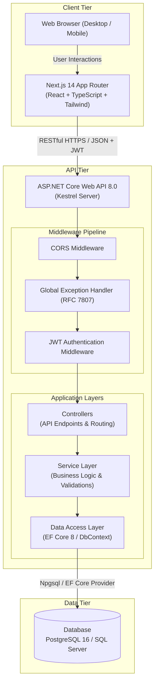
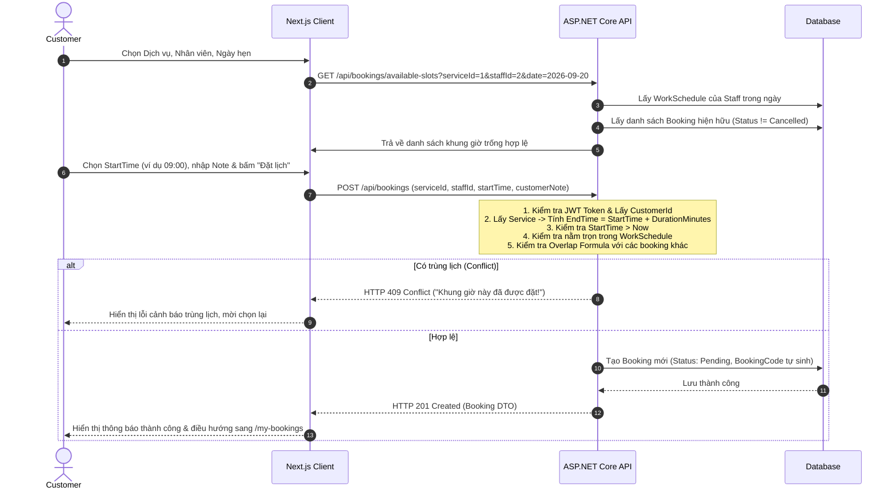

# KIẾN TRÚC HỆ THỐNG (SYSTEM ARCHITECTURE)
## Service Booking Management System

Tài liệu này mô tả chi tiết kiến trúc tổng thể, mô hình phân tầng, luồng xử lý dữ liệu và các quyết định thiết kế kỹ thuật cho toàn bộ dự án.

---

## 1. SƠ ĐỒ TỔNG THỂ HỆ THỐNG (HIGH-LEVEL ARCHITECTURE)



---

## 2. KIẾN TRÚC BACKEND (ASP.NET CORE 8)

Backend được tổ chức theo kiến trúc phân tầng rõ ràng (Separation of Concerns), đảm bảo tính module hóa, dễ bảo trì và dễ viết Unit Test:

```text
backend/
├── BookingSystem.sln
├── src/
│   └── BookingSystem.Api/
│       ├── Controllers/            # Tiếp nhận HTTP request, validate DTO, gọi Service, trả response
│       │   ├── AuthController.cs
│       │   ├── ServicesController.cs
│       │   ├── StaffsController.cs
│       │   └── BookingsController.cs
│       ├── Data/                   # Tầng truy cập dữ liệu qua EF Core
│       │   ├── ApplicationDbContext.cs
│       │   ├── Migrations/
│       │   └── SeedData/           # Seed tài khoản Admin, Customer, Dịch vụ, Nhân viên, Lịch hẹn
│       ├── Models/
│       │   ├── Entities/           # Thực thể CSDL (User, Service, Staff, WorkSchedule, Booking)
│       │   ├── DTOs/               # DTO Requests & Responses riêng biệt, không expose Entity
│       │   └── Enums/              # BookingStatus (Pending, Confirmed, Completed, Cancelled), UserRole
│       ├── Services/               # Toàn bộ business logic nghiệp vụ
│       │   ├── Interfaces/         # IAuthService, IBookingService, ISlotCalculationService, etc.
│       │   └── Implementations/
│       ├── Common/
│       │   ├── Exceptions/         # Custom Exceptions (NotFoundException, ConflictException, ForbiddenException)
│       │   ├── Middleware/         # Global Exception Handler Middleware
│       │   └── Security/           # JWT Helper, PasswordHasher, CurrentUserContext
│       ├── Program.cs              # Cấu hình DI, Middleware, Authentication, Swagger
│       └── appsettings.json
└── tests/
    └── BookingSystem.Tests/        # Bộ kiểm thử tự động xUnit
        ├── UnitTests/              # Test thuật toán chống trùng lịch, tính toán slot, validate DTO
        └── IntegrationTests/       # Test API endpoints với In-Memory Database
```

### 2.1. Các nguyên tắc thiết kế Backend bắt buộc
1. **DTO Pattern**: Tuyệt đối không trả entity trực tiếp ra ngoài controller. Luôn map qua DTO để kiểm soát chặt chẽ trường dữ liệu và chống Over-posting / Data Leakage.
2. **Asynchronous (Async/Await)**: Mọi thao tác I/O với database đều sử dụng `async`/`await` (`ToListAsync`, `FirstOrDefaultAsync`, `SaveChangesAsync`).
3. **Database Pagination**: Luôn phân trang trực tiếp ở tầng CSDL bằng `IQueryable.Skip().Take()`, không bao giờ `ToList()` toàn bộ bảng lên RAM.
4. **Global Exception Handling**: Mọi ngoại lệ nghiệp vụ (`NotFoundException`, `ConflictException`, `ForbiddenException`, `ValidationException`) được bắt tập trung tại middleware và chuyển thành phản hồi JSON RFC 7807 chuẩn.

---

## 3. KIẾN TRÚC FRONTEND (NEXT.JS 14 APP ROUTER)

Frontend được xây dựng bằng Next.js App Router với TypeScript nghiêm ngặt (Strict Type Safety) và Tailwind CSS:

```text
frontend/
├── src/
│   ├── app/
│   │   ├── layout.tsx              # Root Layout: Navbar, Toaster, AuthProvider
│   │   ├── page.tsx                # Landing page chuyển hướng sang /services
│   │   ├── login/page.tsx          # Trang đăng nhập cho Customer & Admin
│   │   ├── services/page.tsx       # Danh sách dịch vụ công khai & nút Đặt lịch
│   │   ├── booking/page.tsx        # Luồng đặt lịch từng bước: Dịch vụ -> Thợ -> Ngày -> Khung giờ trống
│   │   ├── my-bookings/page.tsx    # Danh sách booking cá nhân của Customer & Popup hủy lịch
│   │   └── admin/                  # Khu vực quản trị viên
│   │       ├── services/page.tsx   # Quản lý CRUD dịch vụ (thêm, sửa, bật/tắt)
│   │       ├── schedules/page.tsx  # Thiết lập ca làm việc cho nhân viên theo ngày
│   │       └── bookings/page.tsx   # Danh sách toàn bộ booking, lọc đa năng, cập nhật trạng thái
│   ├── components/
│   │   ├── layout/                 # Navbar, Footer, AdminSidebar
│   │   ├── ui/                     # Button, Input, Select, Modal, Badge, Table, Card
│   │   └── feedback/               # LoadingSkeleton, EmptyState, ErrorAlert
│   ├── lib/
│   │   ├── api-client.ts           # Wrapper gọi API Axios/Fetch tự động kèm Bearer Token & bắt 401
│   │   ├── auth.ts                 # Quản lý Auth State, Token Storage (Cookies / LocalStorage)
│   │   └── utils.ts                # Format tiền tệ VND, định dạng ngày giờ VN, cn helper
│   └── types/                      # TypeScript Interface / Type khớp hoàn toàn với Backend DTOs
```

### 3.1. Tiêu chuẩn giao diện Frontend bắt buộc
1. **3 trạng thái UI thiết yếu**:
   - **Loading State**: Skeleton loading đẹp mắt trong lúc chờ API phản hồi.
   - **Empty State**: Minh họa rõ ràng kèm thông báo khi không có dữ liệu.
   - **Error State**: Thông báo lỗi lịch sự kèm hướng dẫn thử lại khi API thất bại.
2. **Chống Click Spam**: Nút submit form tự động bị `disabled` và hiện icon quay spinner khi request đang trong tiến trình gửi.
3. **Hiển thị lỗi 409 Conflict**: Khi bị trùng lịch, hiển thị cảnh báo trực quan yêu cầu khách chọn khung giờ khác.

---

## 4. LUỒNG ĐẶT LỊCH VÀ XỬ LÝ XUNG ĐỘT (BOOKING SEQUENCE)


