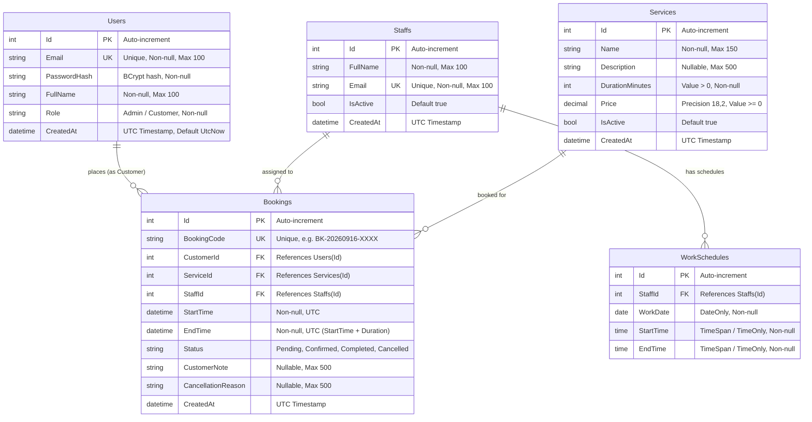

# MÔ HÌNH DỮ LIỆU & ERD (DATABASE SCHEMA & ERD)
## Service Booking Management System

Tài liệu này chi tiết hóa cấu trúc 5 bảng dữ liệu cốt lõi, quan hệ ràng buộc, kiểu dữ liệu và chiến lược lập chỉ mục (Indexing) cho hệ thống cơ sở dữ liệu.

---

## 1. SƠ ĐỒ THỰC THỂ QUAN HỆ (ENTITY-RELATIONSHIP DIAGRAM)

---

## 2. CHI TIẾT CÁC BẢNG & RÀNG BUỘC (TABLE SCHEMAS & CONSTRAINTS)

### 2.1. Bảng `Users` (Người dùng)
Lưu trữ thông tin tài khoản đăng nhập cho cả Customer và Admin.
- `Id` (INT, PK, Identity): Mã định danh duy nhất.
- `Email` (NVARCHAR(100), NOT NULL, UNIQUE): Email đăng nhập duy nhất.
- `PasswordHash` (NVARCHAR(255), NOT NULL): Mật khẩu băm (BCrypt).
- `FullName` (NVARCHAR(100), NOT NULL): Họ và tên người dùng.
- `Role` (NVARCHAR(20), NOT NULL): Vai trò (`Admin`, `Customer`).
- `CreatedAt` (DATETIME2, NOT NULL): Thời điểm tạo tài khoản.

### 2.2. Bảng `Services` (Dịch vụ)
Lưu danh sách dịch vụ do cơ sở cung cấp.
- `Id` (INT, PK, Identity): Mã dịch vụ.
- `Name` (NVARCHAR(150), NOT NULL): Tên dịch vụ.
- `Description` (NVARCHAR(500), NULL): Mô tả chi tiết dịch vụ.
- `DurationMinutes` (INT, NOT NULL): Thời lượng thực hiện tính bằng phút (`CHECK (DurationMinutes > 0)`).
- `Price` (DECIMAL(18,2), NOT NULL): Giá dịch vụ (`CHECK (Price >= 0)`).
- `IsActive` (BOOLEAN, NOT NULL, DEFAULT true): Trạng thái kích hoạt.
- `CreatedAt` (DATETIME2, NOT NULL): Thời điểm tạo dịch vụ.

### 2.3. Bảng `Staffs` (Nhân viên)
Lưu thông tin kỹ thuật viên / nhân viên thực hiện dịch vụ.
- `Id` (INT, PK, Identity): Mã nhân viên.
- `FullName` (NVARCHAR(100), NOT NULL): Họ tên nhân viên.
- `Email` (NVARCHAR(100), NOT NULL, UNIQUE): Email nhân viên.
- `IsActive` (BOOLEAN, NOT NULL, DEFAULT true): Trạng thái nhân viên đang làm việc hay đã bị khóa.
- `CreatedAt` (DATETIME2, NOT NULL): Thời điểm tạo.

### 2.4. Bảng `WorkSchedules` (Lịch làm việc của nhân viên)
Quản lý ca làm việc của từng nhân viên theo từng ngày cụ thể.
- `Id` (INT, PK, Identity): Mã ca làm việc.
- `StaffId` (INT, NOT NULL, FK -> `Staffs.Id`, ON DELETE CASCADE): Nhân viên được xếp ca.
- `WorkDate` (DATE, NOT NULL): Ngày làm việc.
- `StartTime` (TIME, NOT NULL): Giờ bắt đầu ca làm việc.
- `EndTime` (TIME, NOT NULL): Giờ kết thúc ca làm việc (`CHECK (StartTime < EndTime)`).
- *Ràng buộc logic*: Không cho phép 1 nhân viên có 2 ca làm việc bị chồng chéo thời gian trong cùng một ngày.

### 2.5. Bảng `Bookings` (Lịch đặt chỗ)
Lưu thông tin lịch hẹn của khách hàng.
- `Id` (INT, PK, Identity): Mã booking nội bộ.
- `BookingCode` (VARCHAR(30), NOT NULL, UNIQUE): Mã booking hiển thị cho khách hàng (ví dụ: `BK-20260916-A1B2`).
- `CustomerId` (INT, NOT NULL, FK -> `Users.Id`, ON DELETE RESTRICT): Khách hàng đặt lịch.
- `ServiceId` (INT, NOT NULL, FK -> `Services.Id`, ON DELETE RESTRICT): Dịch vụ được đặt.
- `StaffId` (INT, NOT NULL, FK -> `Staffs.Id`, ON DELETE RESTRICT): Nhân viên được giao.
- `StartTime` (DATETIME2, NOT NULL): Giờ bắt đầu hẹn.
- `EndTime` (DATETIME2, NOT NULL): Giờ kết thúc hẹn (Tính tự động từ `StartTime + Service.DurationMinutes`).
- `Status` (VARCHAR(20), NOT NULL): Trạng thái booking (`Pending`, `Confirmed`, `Completed`, `Cancelled`).
- `CustomerNote` (NVARCHAR(500), NULL): Ghi chú bổ sung từ khách hàng.
- `CancellationReason` (NVARCHAR(500), NULL): Lý do hủy booking (bắt buộc nhập khi chuyển sang trạng thái Cancelled).
- `CreatedAt` (DATETIME2, NOT NULL): Thời điểm tạo booking.

---

## 3. CHIẾN LƯỢC ĐÁNH CHỈ MỤC (INDEXING STRATEGY)

Để tối ưu hóa tốc độ truy vấn kiểm tra trùng lịch (Conflict Detection) và phân trang danh sách:
1. `IX_Users_Email`: UNIQUE INDEX trên `Users(Email)`.
2. `IX_Staffs_Email`: UNIQUE INDEX trên `Staffs(Email)`.
3. `IX_Bookings_BookingCode`: UNIQUE INDEX trên `Bookings(BookingCode)`.
4. `IX_Bookings_ConflictCheck`: Composite Index trên `Bookings(StaffId, Status, StartTime, EndTime)` để tăng tốc độ truy vấn thuật toán chống trùng lịch.
5. `IX_WorkSchedules_Staff_Date`: Composite Index trên `WorkSchedules(StaffId, WorkDate)` phục vụ tính toán khung giờ trống.
